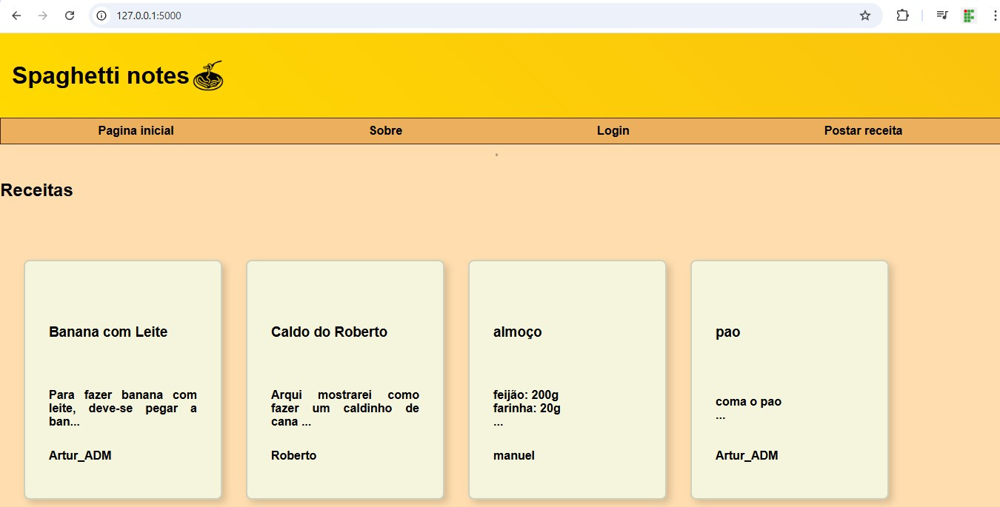

# 🍝 Spaghetti Notes



## 📖 Introdução  
Este projeto foi desenvolvido para o projeto final das disciplinas de **Programação para Web I** e **Introdução a Algoritmos**, do curso de Bacharelado em **Engenharia de Software** do **IFPB** com o objetivo de aplicar na prática os conceitos fundamentais de desenvolvimento web, organização de código e estruturação de aplicações dinâmicas.  
A aplicação proposta consiste em um site de receitas, funcionando de forma semelhante a um blog, no qual usuários podem interagir e compartilhar conteúdos.

---

## 👥 Integrantes  
- Artur Souza  
- Gerson Rocha  
- Josué Neto  

---

## ⚙️ Funcionalidades  
O **Spaghetti Notes** é um site de receitas que possui as seguintes funcionalidades:  

- 📌 **Visualização de receitas**: qualquer usuário pode acessar e explorar as receitas cadastradas no sistema.  
- 🔑 **Cadastro e login de usuários**: visitantes podem se registrar ou autenticar-se para ter acesso a recursos exclusivos.  
- ✍️ **Criação de receitas próprias**: usuários autenticados podem criar, editar e publicar suas próprias receitas, tornando a aplicação colaborativa.  
- 🗂️ **Ambiente tipo blog**: as receitas ficam organizadas em formato de postagens, facilitando a navegação e a interação com os conteúdos.  

---

## 🛠️ Tecnologias Utilizadas  
- **Python** → linguagem principal para o backend  
- **Flask** → framework web utilizado para a estrutura da aplicação  
- **HTML & CSS** → construção e estilização do front-end  

---

## 🚀 Nome do Projeto  
**Spaghetti Notes**  
Um espaço digital para compartilhar, organizar e criar receitas de forma simples, intuitiva e colaborativa.

---

## 💻 Como Rodar o Projeto

Siga os passos abaixo para executar o **Spaghetti Notes** localmente:

### 1. Clonar o repositório
```bash
git clone <URL_DO_REPOSITORIO>
cd spaghetti-notes
````

### 2. Criar um ambiente virtual

```bash
python -m venv venv
```

### 3. Ativar o ambiente virtual

* **Windows**:

```bash
venv\Scripts\activate
```

* **Linux/MacOS**:

```bash
source venv/bin/activate
```

### 4. Instalar as dependências

```bash
pip install -r requirements.txt
```

### 5. Rodar a aplicação

```bash
python app.py
```

A aplicação estará disponível em `http://127.0.0.1:5000/`.
